# Gui Shortener

A modern URL shortener built with Next.js 14, Redis Cloud, and Vercel.

- Production URL: https://gslink.vercel.app/
- Development URL: http://localhost:300
- API Docs: https://gslink.vercel.app/docs

## Features

- URL shortening with custom IDs
- Real-time analytics
- URL management (enable/disable)
- Dashboard for URL stats
- Redis Cloud for fast URL resolution
- Serverless deployment on Vercel

## Architecture

```mermaid
graph TD
    subgraph Client
        Browser["🌐 Browser"]
    end

    subgraph "Vercel Platform"
        subgraph "Frontend - Next.js"
            Pages["📄 Pages/Routes"]
            Components["🧩 React Components"]
            Pages --> Components
        end

        subgraph "Backend - API Routes"
            API["⚡ API Endpoints"]
            Services["🔧 Services"]
            Models["📊 Models"]

            API --> Services
            Services --> Models
        end

        subgraph "Core Features"
            URLShortener["✂️ URL Shortener"]
            Analytics["📈 Analytics"]
            URLManagement["⚙️ URL Management"]
            Dashboard["📊 Dashboard"]
        end
    end

    subgraph "External Services"
        Redis["🗄️ Redis Cloud"]
    end

    Browser --> Pages
    Browser --> API
    URLShortener --> Redis
    Analytics --> Redis
    URLManagement --> Redis
    API --> Redis

    classDef platform fill:#f9f,stroke:#333,stroke-width:2px
    classDef service fill:#bbf,stroke:#333,stroke-width:2px
    classDef database fill:#dfd,stroke:#333,stroke-width:2px

    class Vercel platform
    class API,Services,Models service
    class Redis database
```



## Tech Stack

Frontend:

- Next.js
- TypeScript
- React
- Tailwind
- Shadcn

Backend:

- Typescript
- Redis
- Nanoid

## Setup

1. Clone repository:

```bash
git clone https://github.com/guiofsaints/gslink
cd gslink
```

2. Install dependencies:

```bash
npm install
```

3. Configure environment variables in `.env.local`:

```
STORAGE_HOST=redis_url
STORAGE_PORT=redis_port
STORAGE_PASSWORD=redis_password
NEXT_PUBLIC_BASE_URL=http://localhost:3000
```

4. Run development server:

```bash
npm run dev
```

5. Access in your browser: http://localhost:3000

## Testing

Run tests:

```bash
# Run all tests
npm test
# Run tests in watch mode
npm run test:watch
# Run tests with coverage
npm run test:coverage
```

Test files are located in the `__tests__` directory and follow the naming convention `*.test.ts`.

## Structure

```
public/               # public assets
src/                  # Application sources
  | __tests__/        # API test files
  | app/              # Routes files
  | components/       # React Component files
  | lib/              # Shared functions
  | models/           # Database models
  | services/         # Services files
```

## API Routes

- `POST /api/shorten`: Create short URL
- `GET /api/shorten`: Get ALL Short URL
- `PATCH /api/shorten`: Update short URL
- `DELETE /api/shorten/:shortCode`: Delete short URL
- `GET /:shortCode`: Redirect to original URL

See more: https://gslink.vercel.app/docs

## Deployment

## Vercel CLI Setup

1. Install Vercel CLI globally:

```bash
npm install -g vercel
```

2. Login to your Vercel account:

```bash
vercel login
```

3. Link your project to Vercel:

```bash
# Navigate to your project directory
cd gslink

# Link to Vercel
vercel link

# Follow the prompts to:
# - Select or create a Vercel account
# - Select or create a project
# - Link to existing project or create new one
```

4. Pull environment variables from Vercel (optional):

```bash
vercel env pull
```

Deploy to Vercel:

```bash
# Deploy to preview
vercel

# Deploy to production
vercel --prod
```
